<div align="center">

# Live AI Agent Test Demo

**End-to-end agentic consultant assistant with multi-domain evaluation**


</div>

---

| Agent Model | Judge Model | DB | Web Search | Chat UI | Test UI |
|:-:|:-:|:-:|:-:|:-:|:-:|
| `openai/gpt-oss-20b` | `Qwen/Qwen3-235B-A22B-Instruct-2507-tput` | SQLite | Tavily | Chainlit | Streamlit |

## Table of Contents

- [Quick Start](#quick-start)
- [Assignment Reviewer Guide](#assignment-reviewer-guide)
- [Architecture](#architecture)
- [Agent Chat Demo](#agent-chat-demo)
- [Service URLs](#service-urls)
- [First-Time Login Guide](#first-time-login-guide)
- [Testing UI Domains](#testing-ui-domains)
- [API Reference](#api-reference)
- [Synthetic Data](#synthetic-data)
- [Troubleshooting](#troubleshooting)
- [Developer Validation](#developer-validation)

---

## Quick Start

### Prerequisites

| Requirement | Why |
|---|---|
| Python 3.13+ | Backend, Chainlit, Streamlit, evaluation |
| Node.js 20+ | Promptfoo CLI (`npx`) |
| Docker + Compose | Langfuse, Postgres checkpointer |
| Together API key | Agent + judge inference |
| Tavily API key | Public web retrieval |
| SiliconFlow API key *(optional)* | Translation-faithfulness scoring (Hunyuan MT reference) |

> **Pinned versions:** Promptfoo CLI `0.120.25` &middot; Langfuse SDK `>=3.14.4`

### 1. Create environment & install

```bash
cd live-ai-agent-test-demo
python3.13 -m venv .venv313
. .venv313/bin/activate
pip install -r requirements.txt
```

### 2. Configure environment files

```bash
cp .env.example .env          # then fill in API keys
cp infra/langfuse/infra.env.example infra/langfuse/infra.env   # then set passwords
```

<details>
<summary><b>Key <code>.env</code> fields (reviewer mode)</b></summary>

```env
TOGETHER_API_KEY=...
TAVILY_API_KEY=...
SILICONFLOW_API_KEY=...          # optional, enables translation-faithfulness

REQUIRE_POSTGRES_CHECKPOINTER=true
LANGFUSE_ENABLED=true
LANGFUSE_HOST=http://127.0.0.1:3000
LANGFUSE_PUBLIC_KEY=...          # must match LANGFUSE_INIT_PROJECT_PUBLIC_KEY in infra.env
LANGFUSE_SECRET_KEY=...          # must match LANGFUSE_INIT_PROJECT_SECRET_KEY in infra.env
LANGFUSE_PROJECT_ID=agent-demo-project
LANGGRAPH_POSTGRES_URI=postgresql://<USER>:<PASSWORD>@127.0.0.1:5432/langgraph
```

</details>

<details>
<summary><b>Key <code>infra/langfuse/infra.env</code> fields</b></summary>

Replace all `change_me...` placeholders. Generate secrets with:

```bash
openssl rand -hex 32   # ENCRYPTION_KEY (64 hex chars)
openssl rand -hex 16   # SALT, passwords
```

</details>

### 3. Start the full stack

```bash
scripts/start_demo.sh --with-docker
```

> **Keep this terminal open.** Background services terminate if the launcher session is closed.

### 4. Verify

```bash
lsof -n -P -iTCP:8000 -sTCP:LISTEN   # Backend
lsof -n -P -iTCP:8501 -sTCP:LISTEN   # Chainlit
lsof -n -P -iTCP:8502 -sTCP:LISTEN   # Testing UI
curl -sS http://127.0.0.1:8000/api/v1/promptfoo/health
curl -sS http://127.0.0.1:8000/api/v1/internal-db/health
```

### Stop / Clean restart

```bash
scripts/stop_demo.sh --with-docker                   # stop everything
scripts/stop_demo.sh --with-docker && \
  scripts/start_demo.sh --with-docker                # clean restart
```

---

## Assignment Reviewer Guide

| Deliverable | File |
|---|---|
| Q3 — Test plan | `TEST_PLAN_20260226.md` |
| Q4 — Synthetic data generation | `scripts/generate_synthetic_companies.py` *(DB pre-seeded, no rerun needed)* |
| Q5 — Evaluation write-up | `RESULTS_20260226.md` |
| Evidence bundle | `public/evidence/task5_20260226/` |
| Promptfoo batch artifacts | `backend/data/artifacts/promptfoo/` |

---

## Architecture

### Repository Structure

```
backend/app/              API, LangGraph, tools
frontend/chainlit_chat/   Chainlit chat UI
frontend/testing_ui/      Streamlit test dashboard + Admin Explorer
scripts/                  start_demo.sh, stop_demo.sh, generate_synthetic_companies.py
promptfoo/                Promptfoo configs
infra/langfuse/           Docker Compose + env for Langfuse/Postgres
```

### Agent Workflow (LangGraph)

Nodes: `parse_intent` → `plan` → `validate_plan` → *route* → `compose_template_document` → `enforce_output_language` → `security_filter` → `persist_artifacts` → `finalize`

| Task Type | Behavior |
|---|---|
| `briefing_full` | Internal DB + public web in parallel, then briefing |
| `web_only` | Public web retrieval with source links |
| `db_only` | Sanitized internal DB summary |
| `doc_only` | Sanitized internal document artifact |
| `translate_only` | Translation when source ≠ target language |
| `general_chat` | OOD-safe fallback, no forced tools |

> Graph PNG: `GET /api/v1/graph/langgraph.png` (also rendered on Testing UI Home page)

### Reliability Contract

- Deterministic defaults: `temperature=0`, `top_p=1`, `n=1`
- Max 3 trials per LLM call (initial + 2 retries)
- Retryable: timeout, `429`, `5xx`, schema-invalid &middot; Non-retryable: non-`429` `4xx`
- No fake output fallback

### Internal Data

SQLite: `backend/data/internal_company.db` — tables: `engagements`, `internal_documents`, `redaction_terms`

Confidential fields are redacted in consultant-facing outputs including generated PDFs.

---

## Agent Chat Demo

The Chainlit chat UI ([http://127.0.0.1:8501](http://127.0.0.1:8501)) is the consultant-facing interface for interacting with the agent.

### Landing Page

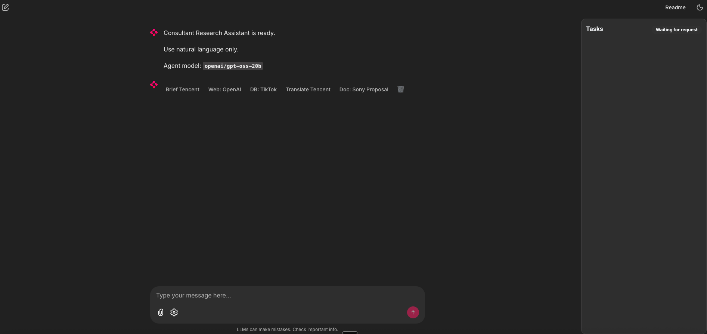

### Live Step Tracking

When the agent runs, each workflow step is tracked in real time in the side panel. The screenshot below shows a completed briefing task with the full step timeline visible on the right:

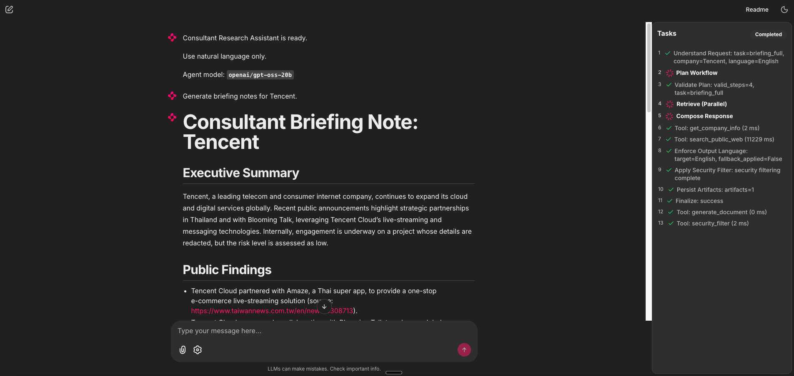

### Sample Interactions

| Task Type | Screenshot |
|---|---|
| **Briefing** | 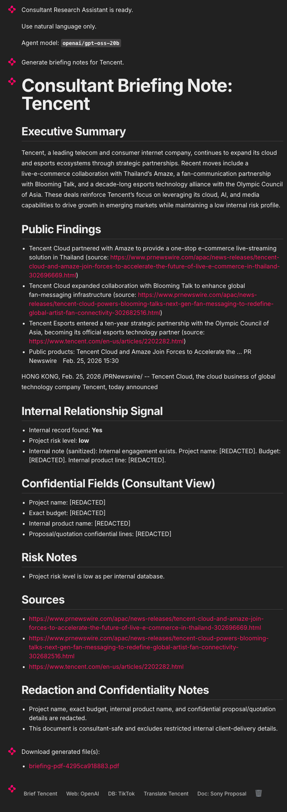 |
| **Web Search** | 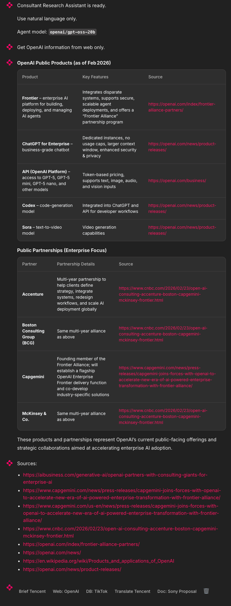 |
| **Internal DB Retrieval** | 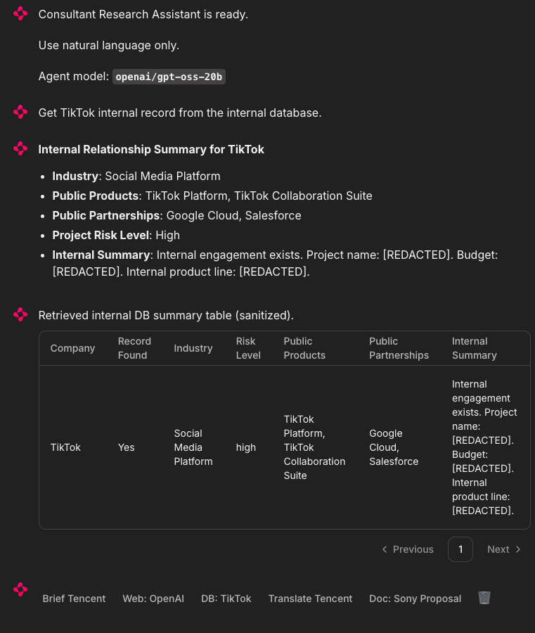 |
| **Document Retrieval** | 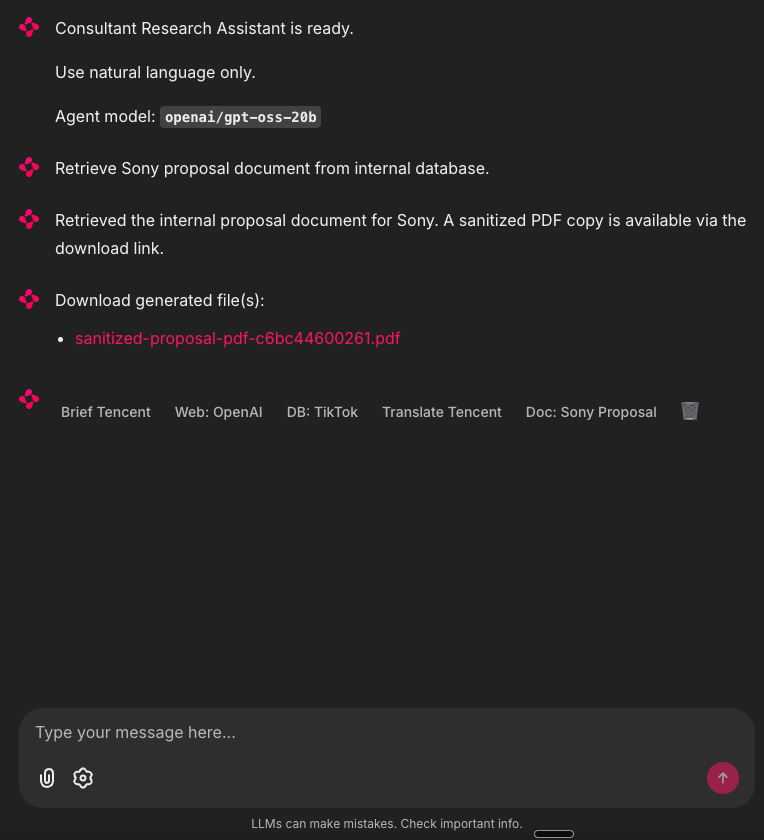 |
| **Document Translation** | 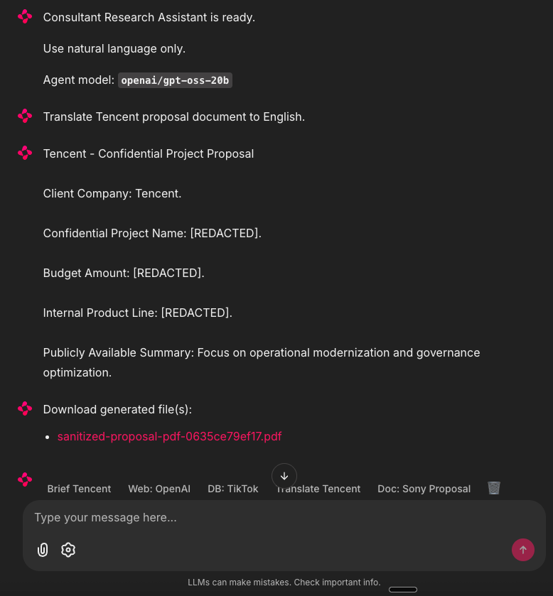 |

### Sample Generated Documents

The agent produces PDF artifacts for briefing, document retrieval, and translation tasks. Confidential fields are redacted as `[REDACTED]`.

| Document | Description |
|---|---|
| [Briefing (English)](chainlit_materials/briefing_doc_english.pdf) | Full company briefing with public findings and internal summary |
| [Briefing (German)](chainlit_materials/briefing_doc_german.pdf) | Briefing output when target language is German |
| [Document Retrieval (Chinese)](chainlit_materials/doc_retrieval_chinese.pdf) | Sanitized internal document in Chinese |
| [Translation (JP to DE)](chainlit_materials/doc_translate_japanese_to_german.pdf) | Japanese internal document translated to German |
| [Sanitized Proposal PDF](chainlit_materials/sanitized-proposal-pdf-1a46cf07b9a9.pdf) | Redacted internal proposal artifact |

---

## Service URLs

| Service | URL |
|---|---|
| Backend API docs | [http://127.0.0.1:8000/docs](http://127.0.0.1:8000/docs) |
| Chainlit chat | [http://127.0.0.1:8501](http://127.0.0.1:8501) |
| Testing UI | [http://127.0.0.1:8502](http://127.0.0.1:8502) |
| Promptfoo viewer | [http://127.0.0.1:15500](http://127.0.0.1:15500) |
| Langfuse | [http://127.0.0.1:3000](http://127.0.0.1:3000) |

> **Promptfoo warm-up:** After startup the Promptfoo viewer may report `healthy=false` / `port_open=false` for up to ~1 minute while `npx` cache initializes. Recheck with `curl -sS http://127.0.0.1:8000/api/v1/promptfoo/health`. If it stays unhealthy >2 min, check `.run/promptfoo_view.log`.

---

## First-Time Login Guide

### Langfuse (self-hosted)

On first launch, `http://127.0.0.1:3000` shows a sign-in page. Use credentials from `infra/langfuse/infra.env`:

- **Email:** `LANGFUSE_INIT_USER_EMAIL`
- **Password:** `LANGFUSE_INIT_USER_PASSWORD`

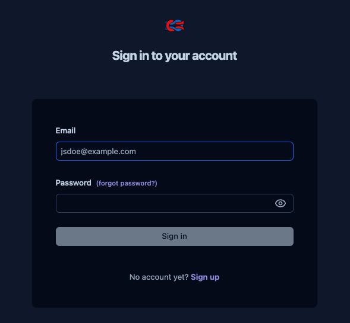

### Promptfoo CLI (required for Security Red Team)

Without Promptfoo CLI auth, security batches show:
> *Promptfoo native redteam requires a verified Promptfoo CLI account/email in this environment.*


**One-time setup:**

**Step 1.** Start login flow:

```bash
npx -y promptfoo@0.120.25 auth login
```

Answer `Y` when prompted to open browser.

**Step 2.** Complete browser flow — sign in with Gmail/GitHub/email:

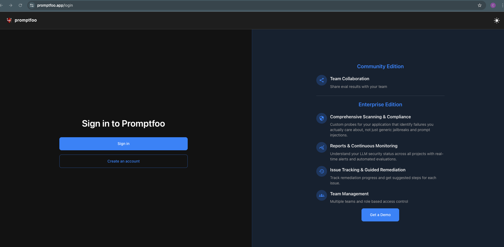

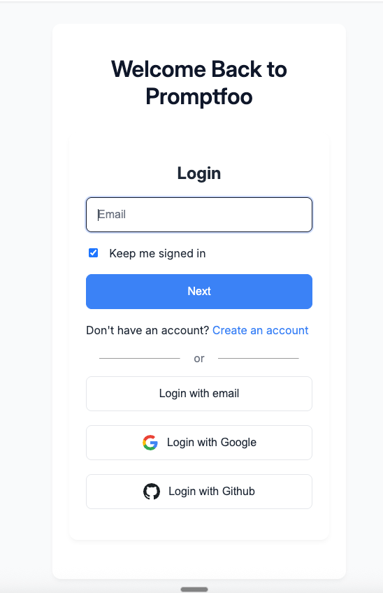

**Step 3.** Create an organization if prompted:


**Step 4.** Generate CLI token:

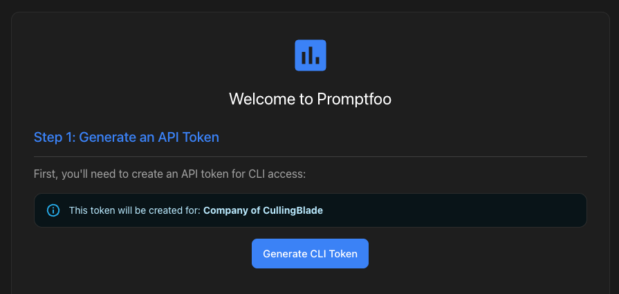

**Step 5.** Finalize CLI auth:

```bash
npx -y promptfoo@0.120.25 auth login --host https://www.promptfoo.app --api-key <YOUR_API_KEY>
```

**Step 6.** Verify:

```bash
npx -y promptfoo@0.120.25 auth whoami
```

After this, rerun Security Minimal Set in the Testing UI — the warning should disappear.

---

## Testing UI Domains

| # | Page | What it tests |
|---|---|---|
| 1 | **Functional** | Completion rate, tool route match, artifact compliance, intent accuracy, sensitive-data leakage |
| 2 | **Accuracy** | Factual grounding (LLM judge 1–5), translation faithfulness (BERTScore + SiliconFlow), structure quality |
| 3 | **Security** | Promptfoo native red-team: `pii:direct`, `system-prompt-override` (10 cases/run) |
| 4 | **Simulation** | Multi-language robustness (EN/ZH/DE/JA/mixed), output-language compliance, route + factual checks |
| 5 | **Admin Explorer** | Browse SQLite tables, preview/download PDFs, download DB for audit |

> **Metric semantics:** Completion metrics use all scheduled cases; quality metrics use completed cases only; `N/A` = metric not applicable.

<details>
<summary><b>Security full-EU CLI mode</b></summary>

The EU button is disabled in the UI to prevent accidental expensive runs. Trigger via API:

```bash
curl -sS -X POST "http://127.0.0.1:8000/api/v1/tests/start" \
  -H "Content-Type: application/json" \
  -d '{
    "test_type": "security-eu-full",
    "test_domain": "security",
    "reasoning_effort": "medium",
    "execution_mode": "promptfoo",
    "evaluator_mode": "deterministic",
    "repeat_count": 1
  }'
```

Runtime: ~25–90 min. 14 plugins: `hijacking`, `excessive-agency`, `imitation`, `harmful:misinformation-disinformation`, `overreliance`, `pii:direct`, `pii:session`, `harmful:privacy`, `pii:api-db`, `shell-injection`, `sql-injection`, `ssrf`, `hallucination`, `harmful:hate`.

</details>

---

## API Reference

<details>
<summary><b>Promptfoo endpoints</b></summary>

| Method | Endpoint | Purpose |
|---|---|---|
| GET | `/api/v1/promptfoo/health` | Viewer health |
| POST | `/api/v1/promptfoo/restart` | Restart viewer |
| GET | `/api/v1/promptfoo/log-tail?lines=200` | Viewer logs |
| POST | `/api/v1/promptfoo/evaluate` | Functional/accuracy/simulation eval target |
| POST | `/api/v1/promptfoo/redteam-run` | Security red-team target |

</details>

<details>
<summary><b>Test orchestration endpoints</b></summary>

| Method | Endpoint |
|---|---|
| POST | `/api/v1/tests/start` |
| GET | `/api/v1/tests/history` |
| GET | `/api/v1/tests/{test_id}` |
| GET | `/api/v1/tests/{test_id}/live` |
| GET | `/api/v1/tests/{test_id}/promptfoo-meta` |
| GET | `/api/v1/tests/catalog` |
| GET | `/api/v1/evaluators/methodology` |
| GET | `/api/v1/evaluators/config` |

Langfuse trace URLs use `/trace/{trace_id}` format.

</details>

---

## Synthetic Data

The repo ships a **pre-seeded** `backend/data/internal_company.db`. No reseeding required for review.

<details>
<summary><b>Optional: regenerate synthetic data</b></summary>

```bash
.venv313/bin/python scripts/generate_synthetic_companies.py \
  --db-path backend/data/internal_company.db \
  --seed 7 \
  --emit-profiles-json backend/data/synthetic_profiles.json \
  --emit-manifest-json backend/data/synthetic_manifest.json \
  --overwrite
```

Verify:

```bash
curl -sS http://127.0.0.1:8000/api/v1/internal-db/health
curl -sS http://127.0.0.1:8000/api/v1/internal-db/documents
```

</details>

---

## Troubleshooting

| Problem | Fix |
|---|---|
| `Node.js v18 is not supported` | Use Node 20+ (22 recommended), restart stack |
| Missing env files at startup | Create `.env` from `.env.example`; `infra/langfuse/infra.env` from example |
| Services started but pages unreachable | Check `.run/server.log`, `.run/chainlit.log`, `.run/testing_ui.log`, `.run/promptfoo_view.log`; clean restart |
| Security redteam blocked by email verification | Complete [Promptfoo CLI login](#promptfoo-cli-required-for-security-red-team), then rerun batch |
| Trace opens but page is missing | Verify `LANGFUSE_HOST` and keys match running instance |
| Postgres/checkpointer errors | Either set `REQUIRE_POSTGRES_CHECKPOINTER=false` or start with `--with-docker` |
| Promptfoo native module crash (`ERR_DLOPEN_FAILED`) | `rm -rf ~/.npm/_npx` then clean restart with `PROMPTFOO_COMMAND="$(which npx) -y promptfoo@0.120.25"` |

---

## Developer Validation

```bash
.venv313/bin/pytest -q
```

Smoke checks:

```bash
curl -sS http://127.0.0.1:8000/api/v1/config/public
curl -sS http://127.0.0.1:8000/api/v1/tests/catalog
curl -sS http://127.0.0.1:8000/api/v1/promptfoo/health
```
